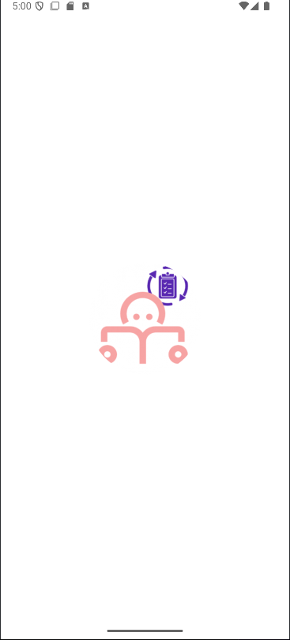
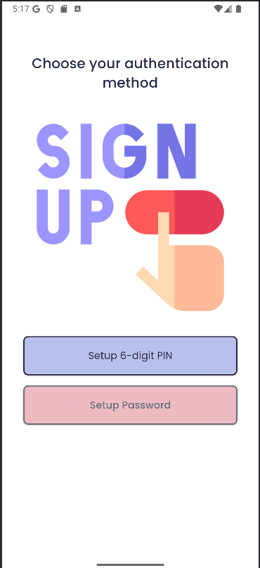
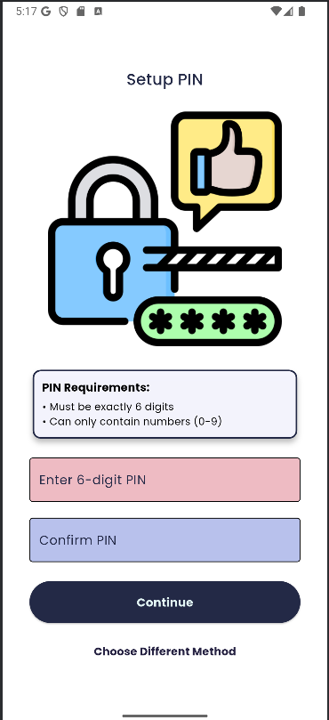
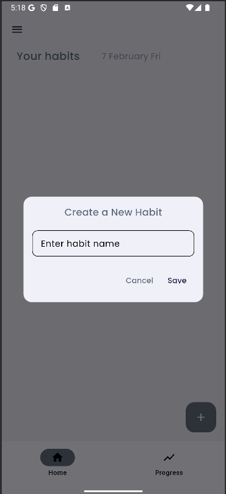
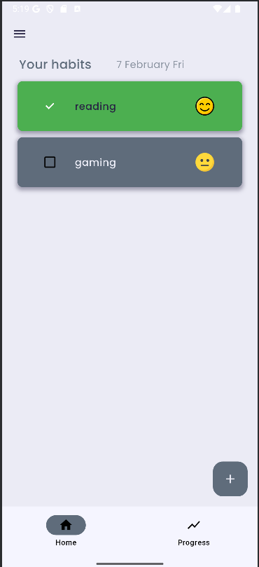
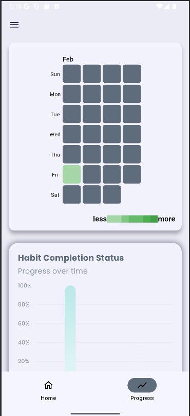

# Habit Tracker

A simple and effective habit tracker to help you build and maintain positive habits.

## Features
- Add, edit, and delete habits
- Track daily progress
- View habit history and statistics
- Simple and intuitive UI

# Tecnhologies Used
- Android: Flutter and Dart
- Database: Isar database/ local

## Table of Contents

- [Installation](#installation)
- [Usage](#usage)

# Installation

Provide step-by-step instructions on how to install and set up your project locally. For example:

- Clone the repository:
```bash
git clone https://github.com/yesheytenzin/habit-tracker.git
```
- Open the project in Android Studio. then
```bash
flutter pub get
```
- Build and run the app on an Android emulator or physical device
```bash
flutter run
```

# Credits
Inspiration from @mitchkoko github project flutterhabittracker

# App Demo
<div style="display: flex; justify-content: space-between;">
  
  
  
</div>

<div style="display: flex; justify-content: space-between;">
  

  

  
</div>
